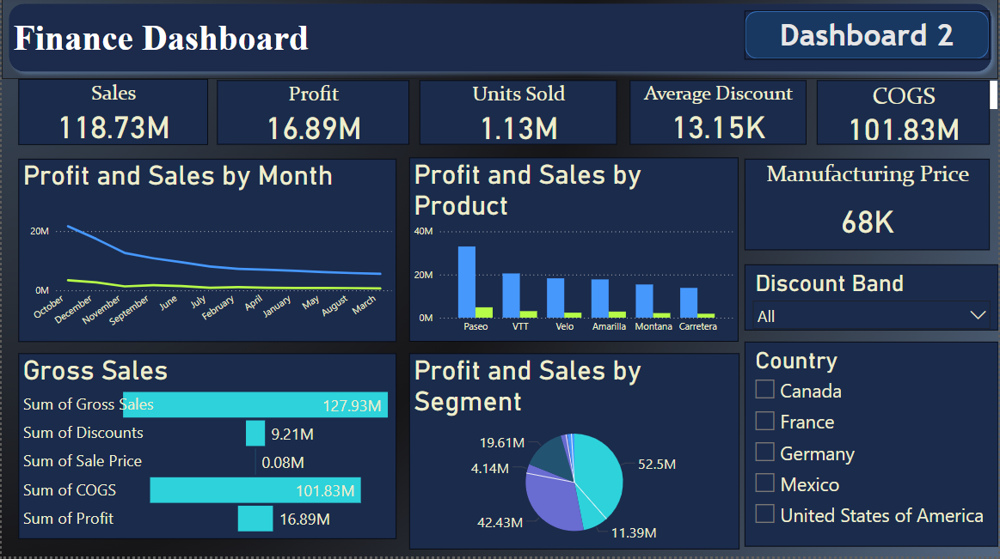

**📊 Project Title**     
**Finance & Sales Insights — Power BI Dashboards**     

**📌 Short Description**     
These Power BI dashboards provide an interactive and visual analysis of key business metrics such as sales, profit, cost of goods sold (COGS), discounts, and performance trends by country, product, and customer segments. They enable stakeholders to monitor financial health, identify profitable products, and make data-driven decisions efficiently.

**⚙️ Tech Stats**    
**📈 Tool Used**: Power BI Desktop & Power BI Service     
**📊 Dataset**: Sample Finance & Sales Data     
**🌍 Region**: Multi-country (Canada, France, Germany, Mexico, USA)     
**📅 Time Period**: Financial Year (sample)     
**💻 Metrics Analyzed**: Sales, Profit, Units Sold, Discounts, COGS, Manufacturing Cost     

**✨ Features and Highlights**        
**📌Navigation**: Easily switch between multiple dashboards via tabs.        
**📊 KPI Cards**: Instant overview of Sales, Profit, Units Sold, Average Discount, and COGS.     
**📈 Visuals**:       
               1.Line Chart for Profit & Sales by Month     
               2.Bar Chart for Product-wise Analysis     
               3.Pie Chart for Segment-wise Contribution     
               4.Treemap for Sales & Profit by Country     
               5.Scatter Plot for Product Profitability     
               6.Combo Chart for Profit & Discount by Units Sold     
**🎛️ Interactive Filters**: Filter by Product, Country, Segment, and Discount Band.     
**🔍 Dynamic Insights**: Drill down on segments for detailed financial trends.   

**📌 Metrics Analysed**     
Total Sales Revenue     
Gross Profit and Profit Margins     
Units Sold     
Discounts & Return Impact     
COGS (Cost of Goods Sold)     
Profit by Product, Segment, and Country     
Monthly Trends & Manufacturing Price Analysis     

**✅ Conclusion**     
These Power BI dashboards showcase comprehensive financial and sales analysis in an intuitive and interactive manner. They empower decision-makers to track key metrics, uncover trends, and identify improvement areas at a glance. This project demonstrates proficiency in dashboard design, KPI reporting, and delivering actionable business insights using Power BI.

     

